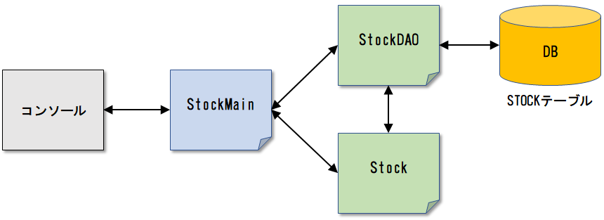

# 在庫管理プログラム

## 処理概要
あるショップの在庫管理をするアプリケーションを作成する。以下の機能を実装する。

**1. 在庫一覧表示**
```
【在庫一覧】
 ID | ITEM                |    PRICE |  QUANTITY |
--------------------------------------------------
  1 | Notebook            |      280 |         5 |
  2 | Pencil              |      120 |        12 |
  3 | Scissors            |      350 |         3 |

*** 処理番号を選択 ***
1:登録　2:更新　3:削除　4:終了
```

**2. 在庫登録機能**

```
*** 処理番号を選択 ***
1:登録　2:更新　3:削除　4:終了
1

【在庫登録】
------ 登録情報を入力してください ------
商品名：Stapler
価格：680
数量：4

登録が完了しました
--------------------------------------

（在庫一覧表示）
```

**3. 在庫更新機能**

※更新内容はすべて入力される想定

```
*** 処理番号を選択 ***
1:登録　2:更新　3:削除　4:終了
2

【在庫更新】
------ 更新するIDを入力してください -------------
ID：3

------ 更新内容を入力してください ---------------
商品名：Scissors
価格：400
数量：8

更新が完了しました
-----------------------------------------------

（在庫一覧表示）
```

指定したIDが存在しない場合

```
【在庫更新】
------ 更新するIDを入力してください -------------
ID：99

指定したIDの在庫は見つかりません
-----------------------------------------------

（在庫一覧表示）
```

**4. 在庫削除機能**

```
*** 処理番号を選択 ***
1:登録　2:更新　3:削除　4:終了
3

【在庫削除】
------ 削除するIDを入力してください -------------
ID：3

削除が完了しました
-----------------------------------------------

（在庫一覧表示）
```

指定したIDが存在しない場合

```
【在庫削除】
------ 削除するIDを入力してください -------------
ID：99

指定したIDの在庫は見つかりません
-----------------------------------------------

（在庫一覧表示）
```

**5. 終了**

```
*** 処理番号を選択 ***
1:登録　2:更新　3:削除　4:終了
4

プログラムを終了します
```

<br>

## 実装方法





**STOCKテーブル**

sample_shopデータベースを作成し、以下のテーブルを作成する。

| 列名 | データ型 | PK | UK | FK | Not Null | 備考 |
|------|---------|:--:|:--:|:--:|:--------:|------|
| ID | INT(11) | 〇 |  |  |  | オートインクリメント |
| ITEM | VARCHAR(20) |  |  |  | 〇 |  |
| PRICE | INT(11) |  |  |  | 〇 |  |
| QUANTITY | INT(11) |  |  |  | 〇 |  |
| UPDATE_DATE | TIMESTAMP |  |  |  | 〇 | 既定値：現在日時 |

```sql
CREATE TABLE STOCK (
    ID        INT(11) AUTO_INCREMENT PRIMARY KEY,
    ITEM      VARCHAR(20) NOT NULL,
    PRICE     INT(11) NOT NULL,
    QUANTITY  INT(11) NOT NULL,
    UPDATE_DATE TIMESTAMP NOT NULL DEFAULT CURRENT_TIMESTAMP ON UPDATE CURRENT_TIMESTAMP
);
```
```sql
INSERT INTO stock (item, price, quantity) VALUES ('Notebook', 280, 5);
INSERT INTO stock (item, price, quantity) VALUES ('Pencil', 100, 12);
INSERT INTO stock (item, price, quantity) VALUES ('Scissors', 350, 3);
```

<br>

**Stock.java（パッケージ：jp.shop.dto）**

フィールド

| 可視性 | フィールド名 |
|:-----:|-------------|
| private | ID |
| private | 商品名 |
| private | 価格 |
| private | 数量 |

メソッド
※フィールドに関連するsetter/getterを定義

<br>

**StockDAO.java（パッケージ：jp.shop.dao）**

| 可視性 | メソッド名 | 戻り値 | 引数 | 説明 |
|-------|------------|-------|------|---------|
| public | findAll  | List\<Stock>    | なし | 在庫データを全件取得する。 |
| public | findById | Stock | int | 引数のIDに紐付く在庫データを取得する。 |
| public | create   | int | Stock | 引数のStockクラスを元に在庫データを登録する。<br>戻り値として登録件数を返却する。 |
| public | update   | int | Stock、int | 引数のIDに紐付く在庫データを更新する。<br>戻り値として更新件数を返却する。 |
| public | delete   | int | int | 引数のIDに紐づく在庫データを削除する。<br>戻り値として削除件数を返却する。 |

コメントでTODO、または ??? となっている部分を正しく実装しなさい。

```java
package jp.shop.dao;

public class StockDAO {

    protected Connection con;

    /**
     * コンストラクタ
     * @param con 接続情報
     */
    public StockDAO(Connection con) {
        this.con = con;
    }

    /**
     * findAllメソッド
     * @return List<Stock> 在庫情報
     */
    public ??? findAll() throws SQLException {
        // TODO
    }

    /**
         * findByIdメソッド
         * @param id ID
         * @return Stock 在庫情報
         */
    public ??? findById(???) throws SQLException {
        // TODO
    }

    /**
     * createメソッド
     * @param stock 在庫情報
     * @return int 登録件数
     */
    public ??? create(???) throws SQLException {
        // TODO
    }

    /**
     * updateメソッド
     * @param stock 在庫情報
     * @param id 更新対象ID
     * @return int 更新件数
     */
    public ??? update(???) throws SQLException {
        // TODO
    }

    /**
     * deleteメソッド
     * @param id 削除対象ID
     * @return int 削除件数
     */
    public ??? delete(???) throws SQLException {
        // TODO
    }
}
```

<br>

**StockMain.java（パッケージ：jp.shop.main）**

| メソッド名 | 戻り値 | 引数 | 説明 |
|------------|-------|------|---------|
| showList  | なし | なし | 在庫一覧表示 |
| create | なし | なし | 在庫登録処理 |
| update   | なし | なし | 在庫更新処理 |
| delete   | なし | なし | 在庫削除処理 |
| main   | なし | String[] | 入力された処理番号により処理を分ける |

コメントでTODOとなっている部分を正しく実装しなさい。

```java
package jp.shop.main;

import java.sql.Connection;
import java.sql.DriverManager;
import java.sql.SQLException;
import java.util.List;
import java.util.Scanner;

import jp.shop.dao.StockDAO;
import jp.shop.dto.Stock;

public class StockMain {

    private static StockDAO dao = null;
    private static Scanner scan = new Scanner(System.in);

    /**
     * 在庫一覧表示
     */
    static void showList() throws SQLException {

        // TODO 在庫情報を全件取得する


        System.out.println("【在庫一覧】");
        System.out.println(String.format("%3s", "ID") + " | " +
                String.format("%-20s", "ITEM") + " | " +
                String.format("%8s", "PRICE") + " | " +
                String.format("%10s", "QUANTITY") + " |");
        System.out.println("----------------------------------------------------");
        for (Stock item : listItem) {
            System.out.println(String.format("%3s", item.getId()) + " | " +
                    String.format("%-20s", item.getItem()) + " | " +
                    String.format("%8s", item.getPrice()) + " | " +
                    String.format("%10s", item.getQuantity()) + " |");
        }
    }

    /**
     * 在庫登録処理
     */
    static void create() throws SQLException {
        System.out.println();
        System.out.println("【在庫登録】");
        System.out.println("------ 登録情報を入力してください ------");

        System.out.print("商品名：");
        String item = scan.next();
        System.out.print("価格：");
        int price = scan.nextInt();
        System.out.print("数量：");
        int quantity = scan.nextInt();

        // TODO Stockクラスのインスタンスを生成し、登録内容をセットする


        /*
         * TODO
         * StockDAOのinsertメソッドを実行する
         * 成功時：「登録が完了しました」
         * 失敗時：「登録に失敗しました」
         */


        System.out.println("----------------------------------------");
        System.out.println();
    }

    /**
     * 在庫更新処理
     */
    static void update() throws SQLException {
        System.out.println();
        System.out.println("【在庫更新】");
        System.out.println("------ 更新するIDを入力してください ------");

        System.out.print("ID：");
        int id = scan.nextInt();

        /*
         * TODO
         * 指定したIDが存在するかチェックする
         * 存在しない場合はメッセージを表示して更新処理を終了する
         * 「指定したIDの在庫は見つかりません」
         */


        System.out.println();
        System.out.println("------ 更新内容を入力してください --------");
        System.out.print("商品名：");
        String item = scan.next();
        System.out.print("価格：");
        int price = scan.nextInt();
        System.out.print("数量：");
        int quantity = scan.nextInt();

        // TODO Stockクラスのインスタンスを生成し、更新内容をセットする


        /*
         * TODO
         * StockDAOのupdateメソッドを実行する
         * 成功時：「更新が完了しました」
         * 失敗時：「更新に失敗しました」
         */


        System.out.println("------------------------------------------");
        System.out.println();
    }

    /**
     * 在庫削除処理
     */
    static void delete() throws SQLException {
        System.out.println();
        System.out.println("【在庫削除】");
        System.out.println("------ 削除するIDを入力してください ------");

        System.out.print("ID：");
        int id = scan.nextInt();

        /*
         * TODO
         * 指定したIDが存在するかチェックする
         * 存在しない場合はメッセージを表示して更新処理を終了する
         * 「指定したIDの在庫は見つかりません」
         */


        /*
         * TODO
         * StockDAOのupdateメソッドを実行する
         * 成功時：「削除が完了しました」
         * 失敗時：「削除に失敗しました」
         */


        System.out.println("------------------------------------------");
        System.out.println();
    }

    public static void main(String[] args) {

        final String URL = "jdbc:mysql://localhost:3306/sample_shop?useSSL=false";
        final String USER = "root";
        final String PASSWORD = "";    // TODO パスワードの設定

        try (Connection con = DriverManager.getConnection(URL, USER, PASSWORD)) {

            loop:
            while (true) {
                dao = new StockDAO(con);

                // 在庫一覧表示
                showList();

                System.out.println("\r\n*** 処理番号を選択 ***");
                System.out.println("1:登録　2:更新　3:削除　4:終了");
                int select = scan.nextInt();

                if (select < 1 || select > 4) {
                    System.out.println("\r\n1～4の処理番号を入力してください");
                    continue;
                }

                switch (select) {
                case 1:
                    // 在庫登録処理
                    create();
                    break;
                case 2:
                    // 在庫更新処理
                    update();
                    break;
                case 3:
                    // 在庫削除処理
                    delete();
                    break;
                case 4:
                    System.out.println("\r\nプログラムを終了します。");
                    break loop;
                }
            }
        } catch (SQLException e) {
            e.printStackTrace();
        }
    }
}
```

<!-- [解答例](/ans/answer.md) -->
